

# Overview
 Final project Ensuring Quality Releases.

# Project Structure 
- **.devops/pipelines**: azure pipelines yaml
- **automatedtesting**: suites of different tests
  - **jmeter**: load test (JMeterPlan.jmx), CSV inputs, and TestReports (endurance-report, stress-report)
  - **postman**: functional tests postman collections and environments
  - **selenium**: ui tests (uitests.py)
- **fakerestapi**: api files to deplopy webapp
- **screenshoots**: all screen shots requests
- **terraform**: terraform scripts

---

# Screenshoots Log

## Environment Creation & Deployment

- Create a Service Principal for Terraform named `TerraformSP` by: `az ad sp create-for-rbac --role="Contributor" --name="TerraformSP"`, and such command outputs 5 values: `appId`, `displayName`, `name`, `password`, and `tenant`.

  - screenshot of the log results of Terraform executed by the CI/CD pipeline
   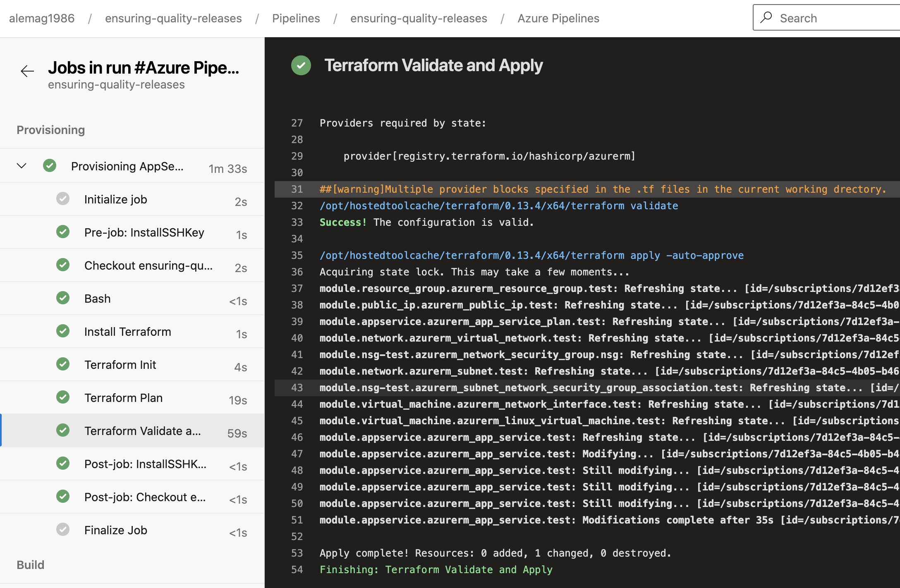
   

## Automated Testing

- screenshot of the log output of JMeter Command Line Options reference with results executed by the CI/CD pipeline
    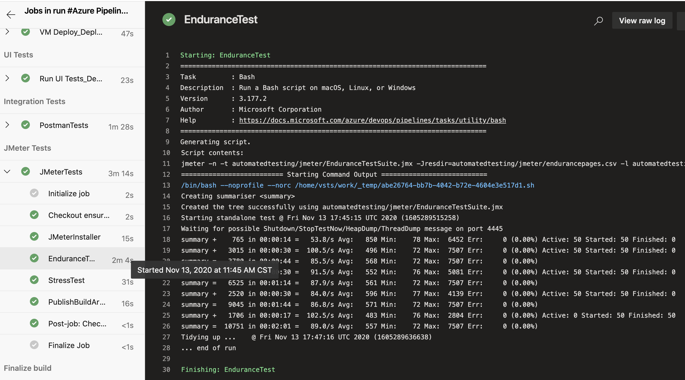
    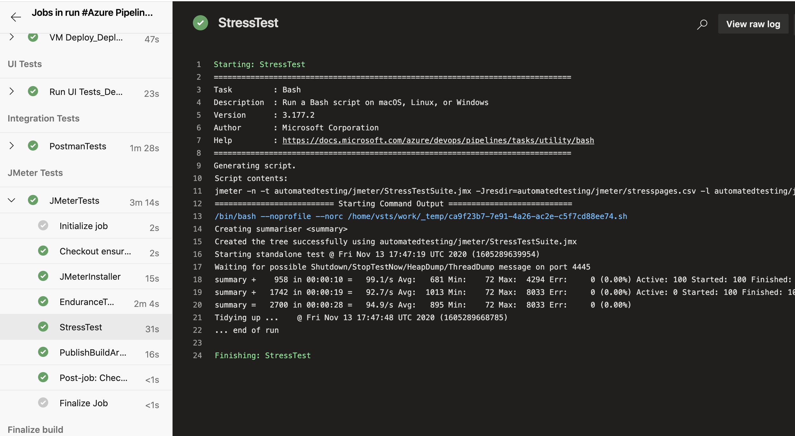
  
- Functional test suites 
  - screenshot of the execution of the test suite by the CI/CD pipeline
   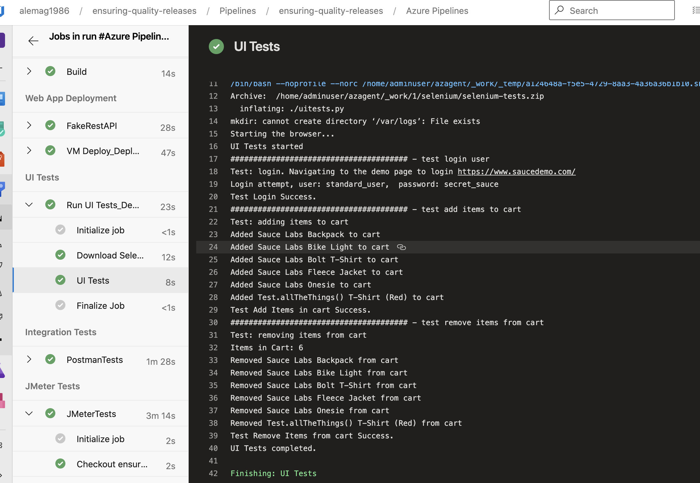

- API-integration tests
  - screenshot of the Run Summary page (which contains 4 graphs)
    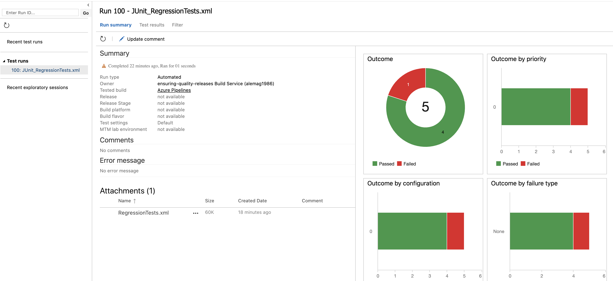
  - screenshot of the Test Results page (which contains the test case titles from each test) 
    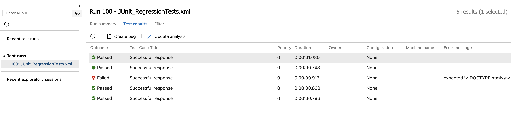
  - screenshot of the output of the Publish Test Results step
    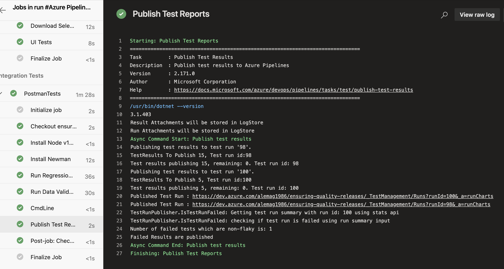

## Monitoring & Observability

- Configure Azure Monitor
  - screenshots of the email received when the alert is triggered
    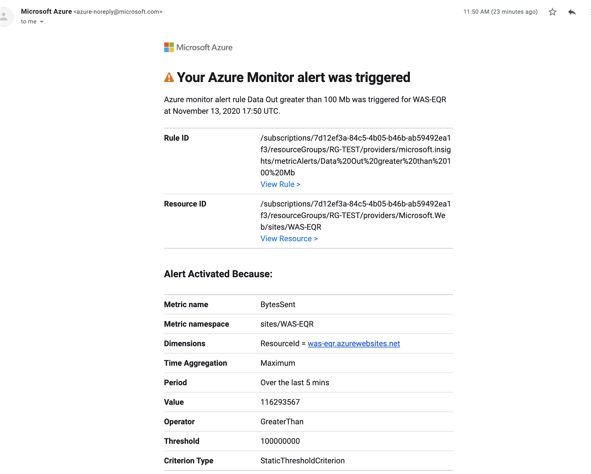
  - screenshots of the graphs of the resource that the alert was triggered
    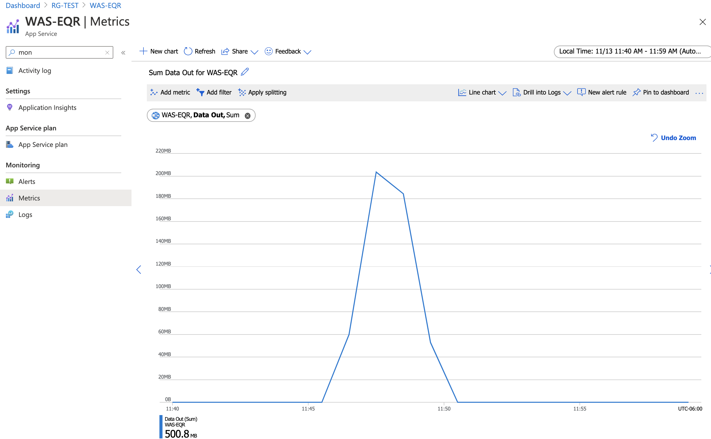
  - screenshots of the alert rule
    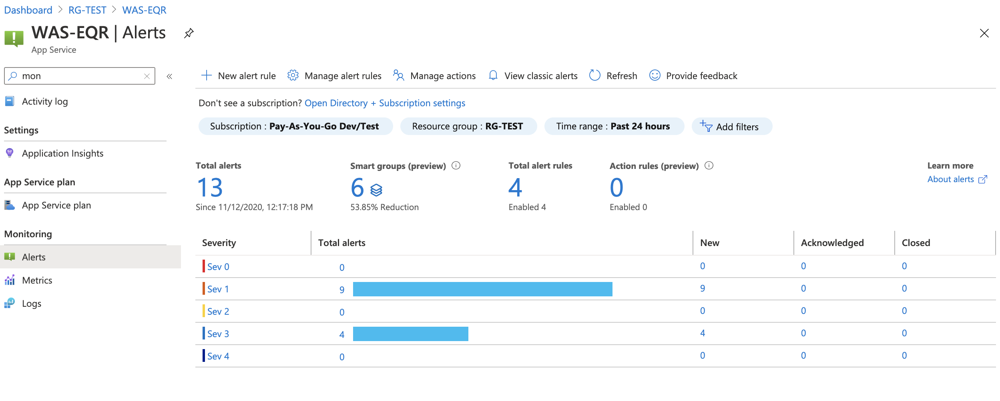

- Azure Log Analytics
  - screenshots of log analytics queries and result sets which will show specific output of the Azure resource
    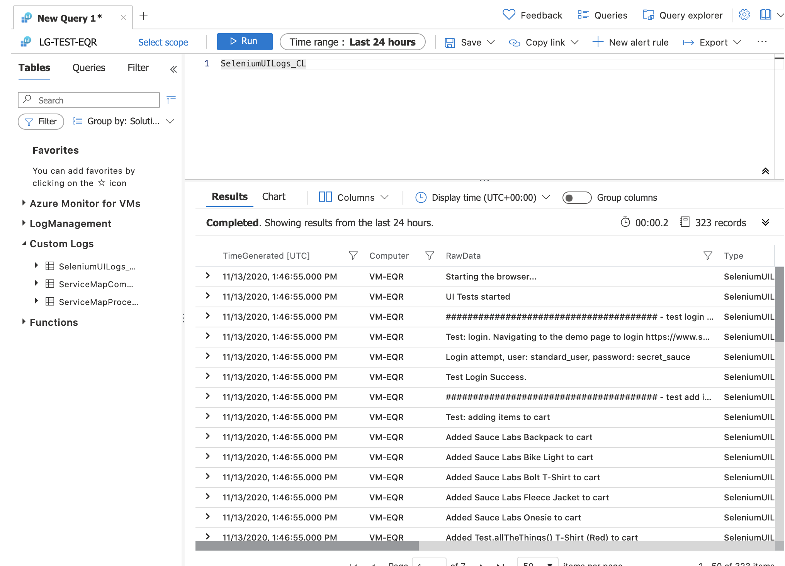
